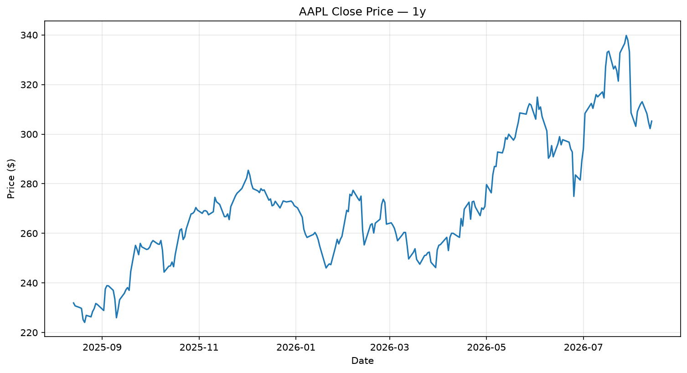

# market-data

Pulls historical price data for a single ticker and plots it.

## What it does

- Downloads daily OHLCV data via `yfinance`
- Prints the first rows and the row count
- Plots closing price and saves it as a PNG

## Usage

```bash
pip install yfinance matplotlib
python market_data.py
```

Change the ticker and period at the top of the file:

```python
TICKER = "AAPL"
PERIOD = "1y"
```

## Output



## Why

First project in a quant/trading skill build. Every backtest, simulation, and factor model starts with getting data in and looking at it. This is that step, working end to end.